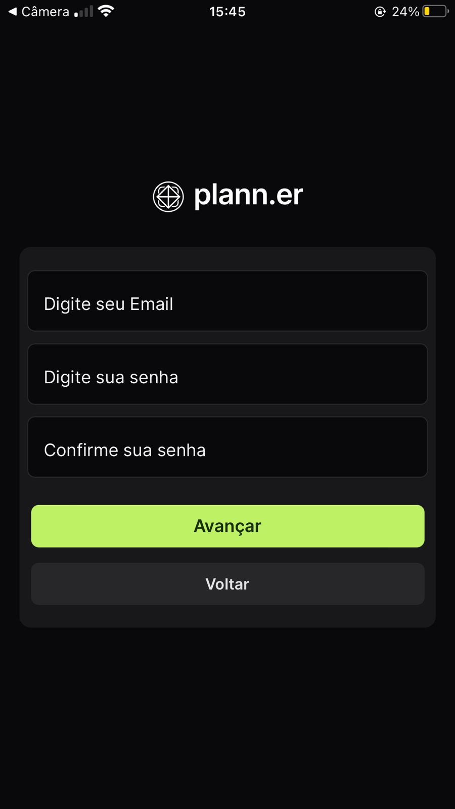
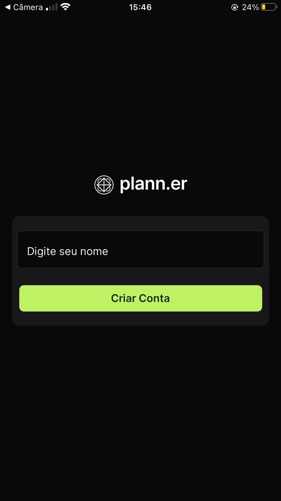
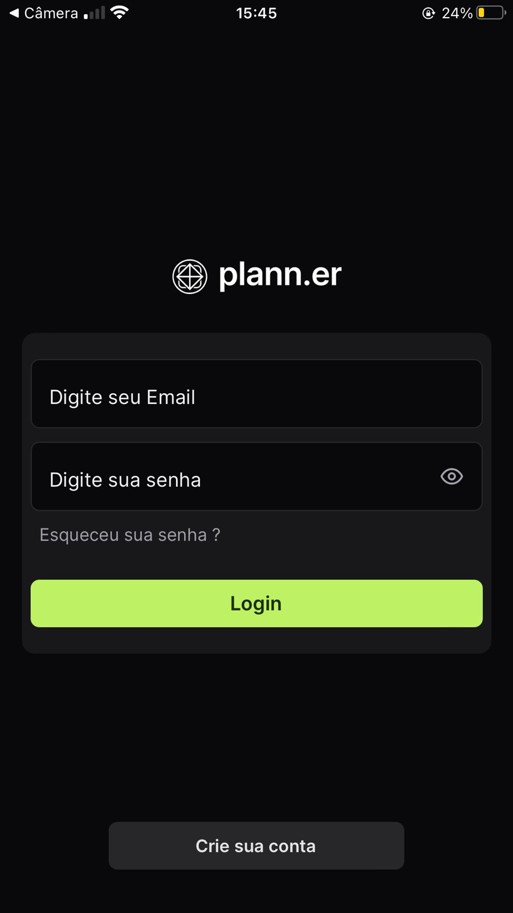
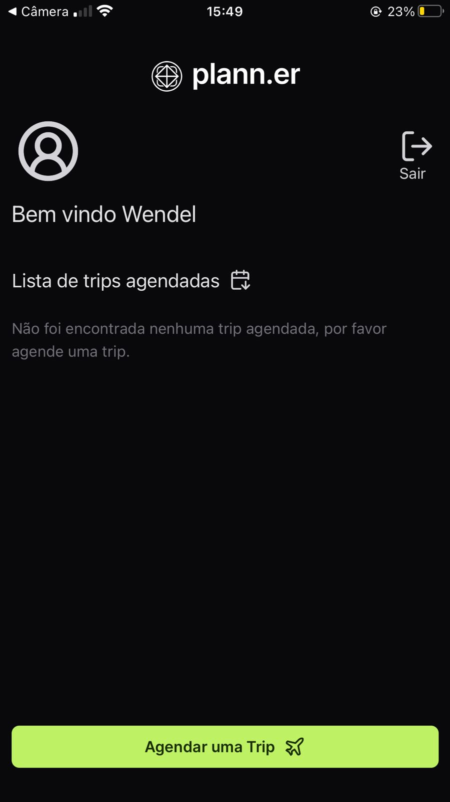
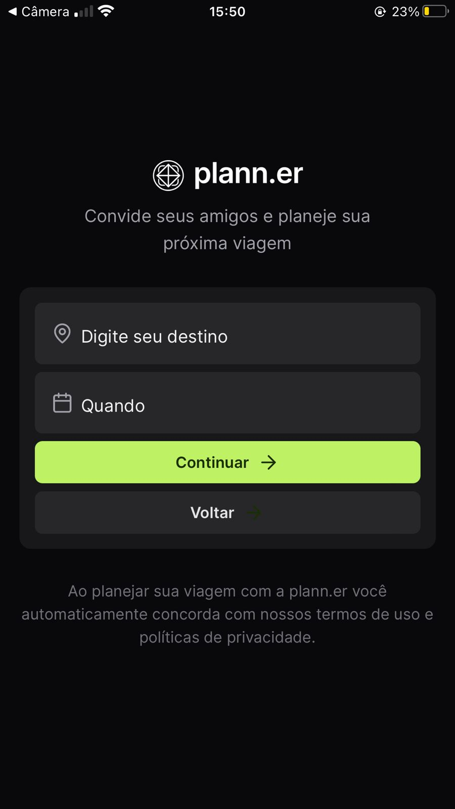
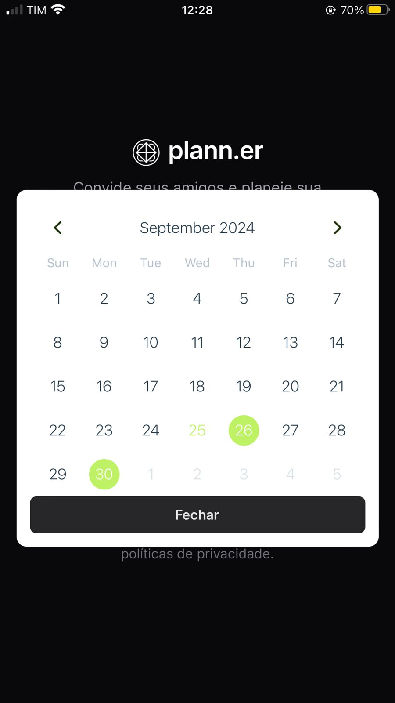
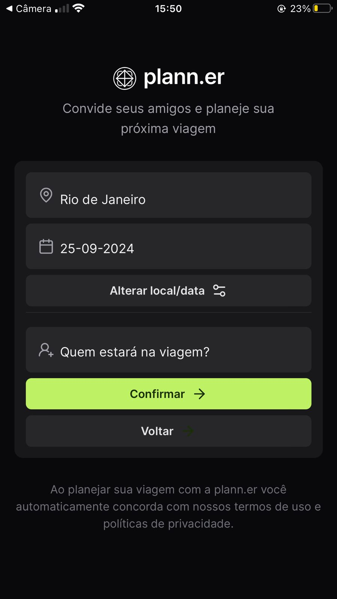
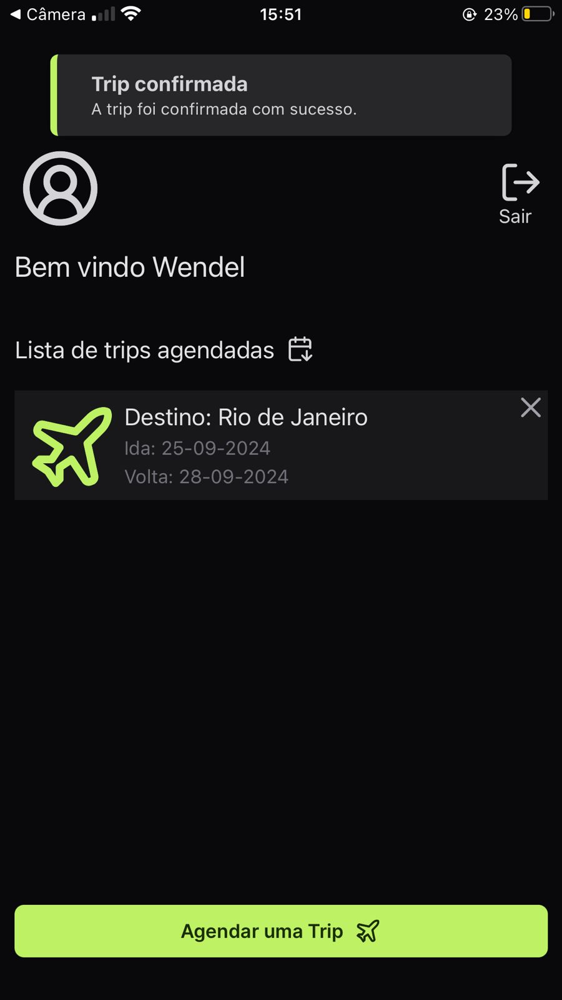
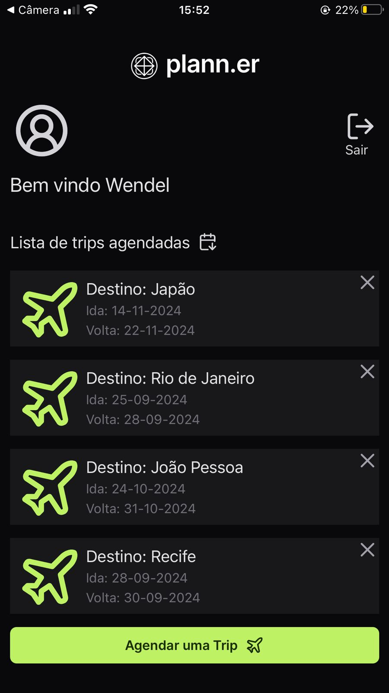
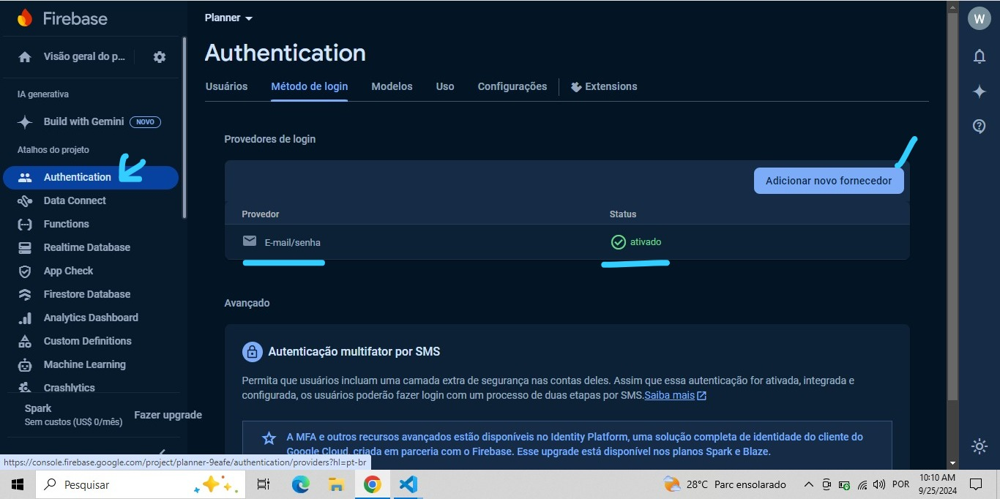

# Planner Mobile App 📱

- Sobre o Projeto:
O Planner é um aplicativo mobile desenvolvido em React Native para ajudar os usuários a organizarem suas viagens. Ele permite agendar e visualizar viagens de maneira prática, com funcionalidades de autenticação, agendamento de trips e gerenciamento de acompanhantes.

 PS: A Proposta desse app foi fornecida e elaborada pela empresa Rocketseat, em um dos seus famosos eventos NLW. Logo, fica aqui meus agradecimentos, pela brilhante ideia, pelo fornecimento do logotipo do App e o layout de uma tela de agendamento. Ademais, o restante da aplicação foi construída de forma independente, sem ajuda do time, por mim.

#  Tecnologias Utilizadas 🛠️
- React Native & TypeScript: Desenvolvimento do aplicativo com uma tipagem robusta.
- Firebase: Autenticação de usuários.
- Axios: Realização de chamadas para rotas do back-end.
- Biblioteca Toast: Notificações com avisos de erro ou sucesso para diversas atividades realizadas pelo usuário.
- Biblioteca de Calendários: Seleção de datas para agendamento das viagens.
- TailwindCSS: Estilização das interfaces com o NativeWind.

# Funcionalidades ✨

- Autenticação com Firebase: Login, criação de conta e recuperação de senha:

Criação de conta, onde o usuário deve inserir um email e uma senha com um mínimo de 6 dígitos. Logo após avançar
é necessário inserir seu nome, que será salvo nos dados de usuário junto ao Firebase, e seguindo o fluxo, é criada 
a conta e é feito o login automaticamente. Todo o processo possui validações, com notificações através do Toast
comunicando o usuário caso ele cometa algum erro.
<div >


</div> 

Login, onde é necessário email e senha para a autenticação. Tela também conta com todas as validações,
com notificações através do Toast comunicando o usuário caso ele cometa algum erro.
<div >

</div> 
 
Recuperação de senha, o usuário insere um email válido já cadastrado na aplicação, solicitando uma nova senha. Um email de recuperação será enviado para o endereço fornecido, desde que o Firebase valide que o email já está registrado.
<div >

</div> 

- Página inicial: Exibição de todas as viagens agendadas pelo usuário, com botão de logout e o de acesso ao agendamento de trips.
<div >

</div>


- Agendamento de Viagens: Definir o destino, datas de ida e volta(nesta ordem), e adicionar acompanhantes, caso o usuário tenha alguém indo na mesma trip.
<div >




</div>

- Home Page retornando as trips agendadas com disponibilidade de excluí-las, caso o usuário deseje cancelar a trip.
<div >


</div>

# Instalação e Execução 📦
- Clone este repositório:

bash ou terminal
```
git clone https://github.com/SeuUsuario/Planner.git
```
- Acesse o diretório do projeto:

bash ou terminal 
```
cd PlannerMobile
```

- Configuração do Firebase: 

Será necessário o ajuste das credenciais privadas de um projeto criado no Firebase. Logo você irá precisar fazer login na sua conta e criar um projeto no (https://console.firebase.google.com/?hl=pt-br).
Assim que criado o projeto será necessário configurar os modelos de autenticação, ativando o Email/Senha, na aba "Authentication", como você pode ver na imagem a seguir:

<div aling='center'>

</div> 

Após essa configuração concluída, você terá que abrir as configurações de projeto no seu console, onde ele irá retornar suas credenciais nesse modelo:
```
const firebaseConfig = {
  apiKey: "**************************",
  authDomain: "**************************",
  projectId: ""*********",
  storageBucket: ""**************************",,
  messagingSenderId: ""********",
  appId: ""*********************************",
  measurementId: "************"
};
```
São dados do seu projeto privados, logo você terá que abrir o arquivo ".env.example" e substituir cada credencial fornecida pelo seu projeto no Firebase, respectivamente:
```
EXPO_PUBLIC_FIREBASE_API_KEY=cole_aqui_suas_credenciais_fornecidas_pelo_Firebase
EXPO_PUBLIC_FIREBASE_AUTH_DOMAIN=cole_aqui_suas_credenciais_fornecidas_pelo_Firebase
EXPO_PUBLIC_PROJECT_ID=cole_aqui_suas_credenciais_fornecidas_pelo_Firebase
EXPO_PUBLIC_STORAGE_BUCKET=cole_aqui_suas_credenciais_fornecidas_pelo_Firebase
EXPO_PUBLIC_MESSAGING_SENDER_ID=cole_aqui_suas_credenciais_fornecidas_pelo_Firebase
EXPO_PUBLIC_APP_ID=cole_aqui_suas_credenciais_fornecidas_pelo_Firebase
EXPO_PUBLIC_MEASUREMENT_ID=cole_aqui_suas_credenciais_fornecidas_pelo_Firebase
```

Altere o nome do arquivo ".env.example" para ".env", e agora o projeto estará pronto para autenticar com o firebase.


- Instale as dependências:

bash ou terminal
```
npm install
```
ou
```
yarn install
```

- Execução do aplicativo:

Após toda a configuração é necessário que você rode o servidor back-end presente neste repositório, feito isso, você terá apenas que rodar sua aplicação localmente através do Expo:

bash ou terminal 
```
npx expo start
```

# APP EM DESENVOLVIMENTO- Funcionalidades Futuras 🚀

A aplicação se encontra em fase de desenvolvimento, então ainda há muitas funcionalidades a serem inseridas, como validações de datas em conflito entre as trip do usuário, exclusão da trip apenas pelo dono da viajem e muito mais. Além disso, novas features como:
- Criação de atividades durante a trip.
- Links pra convites para os acompanhantes aceitarem ou não.
- E muito mais.

# Contribuições🤝
Contribuições são bem-vindas! Se você deseja sugerir melhorias, sinta-se à vontade para abrir uma issue ou enviar um pull request.

